# Basic HTML, CSS, JavaScript, and Testing Tutorial

This will give you an overview of how an HTML page and its resources are 
structured. You will learn the basics of how these resources interact, and how
your JavaScript can manipulate them. You'll also learn a little bit about
testing your code. Basic testing will use Jasmine as that will run in your
browser and requires no other downloads like node.js or selenium. 

I will try to explain as much as I can along the way. There may be some 
concepts that you'll just have to take as further research points from this 
experience. This is really just a primer. 


# Structure

We will, eventually, divide up the code by directories, so we have HTML in this
directory, Javascript in its own `js` directory, Cascading Style Sheets in a
`css` directory, images in an `images` directory, and we'll push tests into a 
`test` directory.

```
-README.md
-hello.html
-hellos.html
-css/
  |-hello.css
-doc/ # images for this README to reference
-images/
  |-hello_my_name_is.png
-js/
  |-names.js
-test/
  |-jasmine/
     |-SpecRunner.html
     |-lib/ # contains jasmine code
     |-spec/
```

# Method

In a perfect world, you would [install git](https://help.github.com/articles/set-up-git/) 
on your computer and clone this repository.

If you would like, you can clone this repository. It will come down in 
its completed form. 

***not implemented yet***
You can wind back the source for each step by checking out 
the tags related to each step. Checking out step0 will have you ready to start
step 1 and checking out step1 will have you ready to start step 2.
***end not implemented yet***

_As of right now, when you check this out, there is only one branch, master, and
it has no tags. Rolling back commits will not necessarily walk you through the 
tutorial and the README.md changes with each commit._ 


# The Tutorial

Each general step will have its own heading. 

## Step 1 - Adding our Image

Images are normally specifiec using an img tag, e.g.,

```

```

*Note*: the image used here came from [wikimedia commons](https://commons.wikimedia.org/wiki/File:Hello_my_name_is_sticker.svg)

However, we eventually want to write on the image and since the JavaScript we
will be writing manipulates the HTML and not the actual image, we are going to
use a trick of layering HTML on top of the image so it looks as one. The best
way to do that is to make the image the background of a block section of the
HTML page. A `div` tag is the best way to do this. We will style that div tag
with CSS.

1. Open hello.html in a text editor:

   ```
   <html>
     <head>
       <title>hello my name is</title>
     </head>
     <body>
       
     </body>
   </html>
   ```

   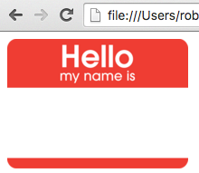

## Step 2 - Making our image writeable.

1. We want to, eventually, programmatically write on the image, so to do that
   we will need to layer on top of it. The best way to do so is to make it a
   background image. We're going to do that with CSS. Add a style attribute to the
   head. As well, create a div in the body and give it the class of `tag`
   ```
   <html>
    <head>
      <title>hello my name is</title>
      <style>
        .tag {
          height: 200px;
          background-image: url("images/hello_my_name_is.png");
          background-size: 200px 143px;
          background-repeat: no-repeat;
          background-position: center;
          font-family: "courier",monospace;
        }
        .tag h1 {
          padding-top: 100px;
          text-align: center;
        }
      </style>
    </head>
    <body>
      <div class="tag">
        <h1 id="nametag_text">world</h1>
      </div>
    </body>
  </html>
  ```
  Save `hello.html` and refresh the page in your browser:

  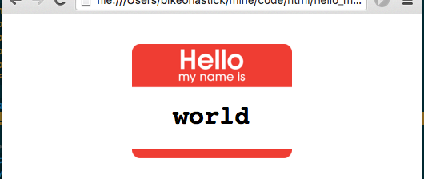

  Look at that! Now, we have text superimposed on the image.

## Step 3 - Making our page interactive

1. We want the page to be interactive, and want the user to be able to input some
   data with which our page can interact. The best way to do that is with a form. 
   Let's add a form to the page just beneath the body tag:
   ```
   <body>
     <form>
       <label for="helloname">What's your Name?</label>
       <input type="text" name="helloname" id="name" />
       <input type="button" onclick="alert(this.form.helloname.value)" value="say hello"/>
     </form>
   ```

   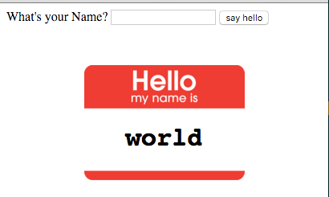

   Pass the form's `helloname` field to the alert method. (alert is a built in 
   javascript method on all browsers and can be a good tool during development. It
   sucks in production, though, so don't leave alerts in real code.)

   Save hello.html, refresh your browser, type a name in the form and click the
   "say hello" button:

   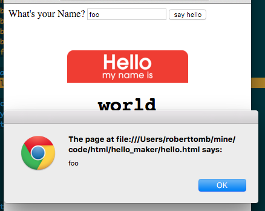

   Yeah! Getting somewhere.

## Step 4 - On to some JavaScript

1. This doesn't do much more than flash what you type in a browser alert box, so
   let's get set up to do something more meaningful, let's create our own 
   javascript function and call it instead. 
   
   Add this to the `head` region of your page:
   ```
    <script> 
      function nameIt(nameVal) {
        alert(nameVal);
      }
    </script>
   ```

   We have written a JavaScript function that takes one argument (arguments
   are passed in the parentheses). Arguments are how you pass information (or context)
   from where the user action occurs to where you are going to use it. Inside the 
   function, you use the argument by name to reference it. Notice, now we 
   alert `nameVal` instead of the form


1. To enable this, change your form to call the new `nameIt` function you created
   ```
    <form>
      <label for="helloname">What's your Name?</label>
      <input type="text" name="helloname" id="name" />
      <input type="button" onclick="nameIt(this.form.helloname.value)" value="say hello"/>
    </form>
   ```

   It still does the same thing, but now it does it through your function! Save 
   hello.html, refresh your browser, type a name in the form, and click the
   "say hello" button, again.

   

   You should see the alert, again. If you do not, check your capitalization. If you
   try to `alert(nameval)` when you used `nameVal` for an argument name in your
   function declaration, you will not see anything happen in your browser window, 
   but you can probably figure out the problem if you look in the javascript 
   console. 
   
   If you are using a modern version of Internet Explorer, Firefox, or 
   Chrome, you have access to developer tools, which are *extremely* handy. Here's
   how to open Chrome's tools:

   open the `developer tools`

   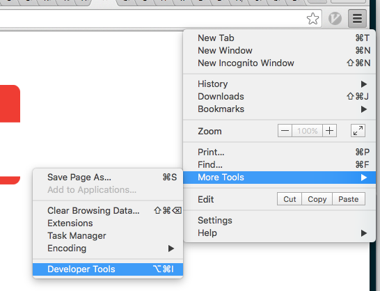

   look in the `console`

   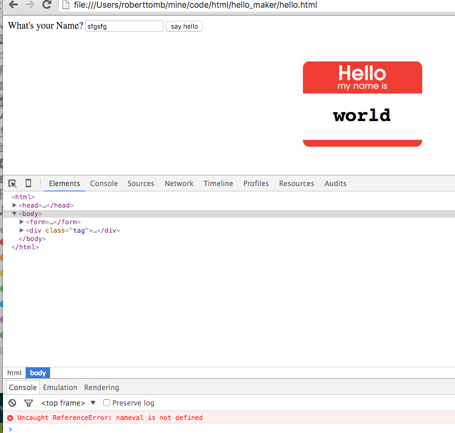

   Were you able to fix the problem? *phew!*

## Step 5 - More meaningful JavaScript

1. Now that we have the form calling your function, we can make it do something
   interesting! From JavaScript, we can manipulate the Document Object Model that
   represents the page we are running in. You can get a reference to an element
   by its `id`, so this is why we had you add the id of *nametag_text* to our h1 tag
   `<h1 id="nametag_text">world</h1>`. We can now use the id of `nametag_text` 
   to get the section we want to manipulate. Once we have that reference, we 
   can set its textContent value
   ```
    <script> 
      function nameIt(nameVal) {
        var theNode = document.getElementById("nametag_text");
        theNode.textContent = nameVal;

        return true;
      }
    </script>
   ```

   *Note*: in case your JavaScript code ran smoothly earlier and you didn't 
   have to debug things, this is a reminder that in JavaScript, case matters! 
   `nameVal` and `nameval` do not refer to the same things.

   Reload your page in your browser and you should now be able to manipulate
   the text that appears to be written in the hello-my-name-is sticker.

## Step 6 - Breaking up the monolith - external CSS

1. Projects get bigger and you will need to share JavaScript and CSS across many
   pages. To do this, you want to put them into their own files. Let's start with
   the style information. Create a new directory called `css` and create a file 
   called `hello.css` in there. 

1. Open hello.css in an editor and copy everything in your style tags into 
   hello.css
   ```
    .tag {
      height: 200px;
      background-image: url("images/hello_my_name_is.png");
      background-size: 200px 143px;
      background-repeat: no-repeat;
      background-position: center;
      font-family: "courier",monospace;
    }
    .tag h1 {
      padding-top: 100px;
      text-align: center;
    }
   ```
   Note: do not include the style tag in your CSS file, it is HTML and not valid
   CSS.

1. Now edit `hello.html` again and delete your existing `<style>...</style>` 
   tag and its content. Replace it with a reference to your new stylesheet:
   ```
     <link rel="stylesheet" type="text/css" href="css/hello.css"/>
   ```

   Reload hello.html in your browser and.... *hey what's going on?* I 
   suspect you can't see your image anymore. That's because I oversimplified
   my earlier instructions. 

1. Instead of just giving you the answer, let's head
   back to the console in the Developer tools:
   
   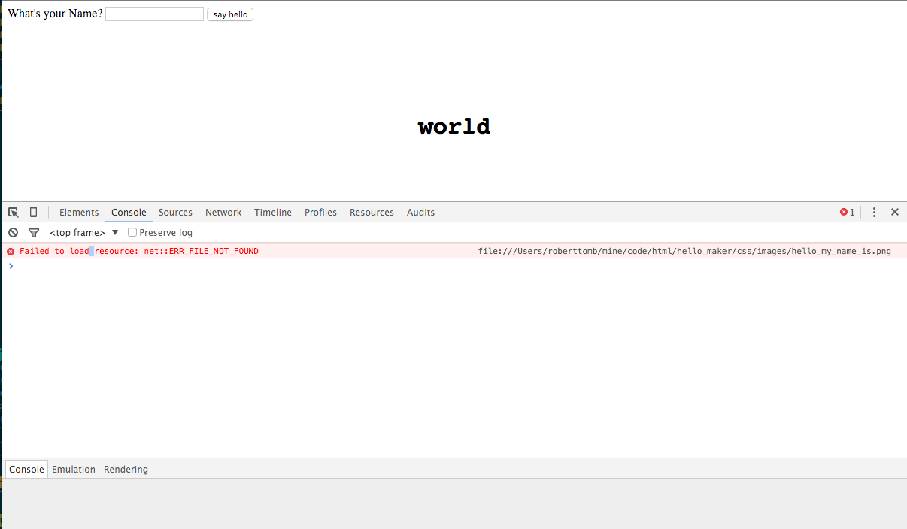

   Notice that it is looking for `hello_my_name_is.png` in an images directory 
   within the css directory. That's not where it is! To fix this you could move
   your images to be below your css folder, but that's an atypical directory 
   structure. You should have your images directory as a sibling to your css
   directory. 
   
1. The image reference in the style info for the `tag` class is different 
   based on where it is used. Since it was originally 
   written in hello.html, the path to hello_my_name_is.png is relative to the
   html page `background-image: url("images/hello_my_name_is.png");` however,
   now that this is in the CSS file (in a different directory) you need to 
   change the image reference:

   ```
    background-image: url("../images/hello_my_name_is.png");
   ```

   We've now moved your CSS into its own file and when we create a new page 
   later, we wil be able to share the CSS code in that page. This is the DRY
   principle, Do not Repeat Yourself. The thing to watch for is when you see 
   yourself starting to copy code for reuse, you should look to find a way
   to write it once and share it. 

## Step 7 - Breaking up the monolith - external JavaScript

1. Speaking of sharing, let's get that Javascript moved into its own file. 
   Make a directory in our project folder called `js` and write a blank file 
   in there named `names.js`

   I create blank files from my terminal window like this `touch js/names.js`. 
   If you're on mac or linux you can do this too. 
   
   Now, open both js/names.js and hello.html up in your text editor and cut 
   the text out of the `<script></script>` tags (not including the script tags, 
   themselves as they are HTML and not valid JavaScript). Now, switch to your 
   `names.js` file and paste the contents of your clipboard into it:
   ```
   function nameIt(nameVal) {
     var theNode = document.getElementById("nametag_text");
     theNode.textContent = nameVal;
   
     return true;
   }
   ```

   Save `names.js` 

1. Now you should have a proper javascript file, but your page won't run the
   code as we need to change the page so it knows about the new script file.

   Switch over to editing hello.html and find the existing empty script tags:
   ```
   <script></script>
   ```

   To look like this:
   ```
   <script src="js/names.js"> </script>
   ```

   Now, the extremely observent people in the group will have noticed that 
   this looks different than our css link tag, which we were able to create as
   an "empty" html tag, which means a tag that won't have anything nested within
   it, (hence empty) and there is a shortened syntax for that `<foo />`, which
   is, functionally the same as `<foo></foo>` but a little shorter to type. The
   *script* tag, however, does not get this advantage. If you try to create 
   your script tag as an empty tag, your page doesn't render properly (at 
   least in the chrome browser).

   Save hello.html and refresh your browser, it should work the same as it 
   did before. You, now, have a well separated project and things are 
   starting to look kind of professional!

# Advanced Topics 

You understand a lot about the structure of an HTML project, but there are a 
few more things to understand that will be helpful:

* Testing
* Evolving the example
* Deployment

I will introduce you to testing and we will add a slightly more sophisticated
version of our lession. 

However, I am not going to walk you through deployment 
as an example. Deployment will depend upon your hosting situation. You will 
want to understand tools like scp, rcp, sftp, oh my! You'll need to pre-process 
your javascript files (uglify, minify) for production. Then, you only want to 
put the files needed for the website into production, so you want to avoid 
deploying your tests and any documentation to the production site. 

As well, once you've decided how you'll deploy, there are a number of tools
and scripting languages to automate deployment. One of the best tools for 
automating the processing and deployment of static websites is 
[gulp](http://gulpjs.com/). 

Anyway... on to testing and the next steps of the example!

## Step 8 - Testing your JavaScript

Ahh, testing. This is super important when a project lives over a long
period of time. It's extremely easy to forget what behavior you meant to 
implement, the last time you were in the code, when you're working on a
project by yourself. It's even _more_ difficult if you are working on a project
with someone else. Sharing code can be difficult, so it's a good idea to 
have executable definitions of what you belive properly functioning code is.

To do this, you should add tests. There are a ton of different ways you can
add tests. I'm going to walk you through one way of doing it: 
[Jasmine](http://jasmine.github.io/). Jasmine was simple to add here, 
because we'll include the jasmine code right in this project, make a small 
test file, and run that file by opening it in the browser. It will just test
the javascript we execute in the test. This is a unit test. If, instead, we 
want to test our HTML page (a functional test) you can use 
[Selenium](http://www.seleniumhq.org/). There are multiple ways to execute
selenium tests, but you need a lot of external dependencies to execute that
I chose not to show you that, here. 

What I want you to understand is that **tests are important** and not very
difficult to add to your project, so keep following this!

1. If you've brought this down locally using git, you've had a 
   directory named `test` in your source tree the whole time. Now we're going
   to use it. I have included a copy of Jasmine's source. If you are starting
   a new project, download a new copy. To add a jasmine test, create the 
   `spec` directory under the `test/jasmine` directory, e.g., from the top of 
   the project directory, 
   ```
   mkdir test/jasmine/spec
   ``` 
   
   the `test/jasmine` directory should contain the jasmine source code

1. Create a test Runner HTML file to execute your Jasmine tests. This file 
   brings together the jasmine libraries for running your tests, all of 
   your source files and all of your tests (specs). Create 
   `test/jasmine/SpecRunner.html` and add the following content:

   ```
    <!DOCTYPE html>
    <html>
    <head>
      <meta charset="utf-8">
      <title>Jasmine Spec Runner v2.4.0</title>
      <link rel="shortcut icon" type="image/png" href="lib/jasmine-2.4.0/jasmine_favicon.png">
      <link rel="stylesheet" href="lib/jasmine-2.4.0/jasmine.css">
      <script src="lib/jasmine-2.4.0/jasmine.js"></script>
      <script src="lib/jasmine-2.4.0/jasmine-html.js"></script>
      <script src="lib/jasmine-2.4.0/boot.js"></script>
    
      <!-- include source files here... -->
      <script src="../../js/names.js"></script>
    
      <!-- include spec files here... -->
      <script src="spec/names_spec.js"></script>
    
    </head>
    
    <body>
    </body>
    </html>
   ```
   
   We are going to test our js/names.js javascript file you need to add a
   reference to it that is relative to SpecRunner.html. As well, you need a 
   reference to your test file. I'm going to have you create names_spec.js 
   in a subdirectory called spec, so add that now. 

1. Now, let's create the test file. Create `test/jasmine/spec/names_spec.js` and 
   open it in a text editor. Then, paste in the following code:

   ```
   describe("names", function() {
     beforeEach(function() {
       var testNode;
       testNode = document.createElement("div");
       testNode.setAttribute("id","nametag_text");
       document.body.appendChild(testNode);
     });
     afterEach(function() {
       var toDel = document.getElementById("nametag_text");
       toDel.parentElement.removeChild(toDel);
     });
   
     it("should set the `nametag_text` node's content", function() {
       var testVal = "foo";
       nameIt(testVal);
       expect(document.getElementById("nametag_text").textContent).toEqual(testVal);
     });
   
   });
   ```

   **wait what?**

   I know that's a lot of code and I will explain some of it in a moment. First,
   let's see your test run!

1. Open SpecRunner.html in your browser. If everything is set up right, the test
   should pass and you should see something like this:

   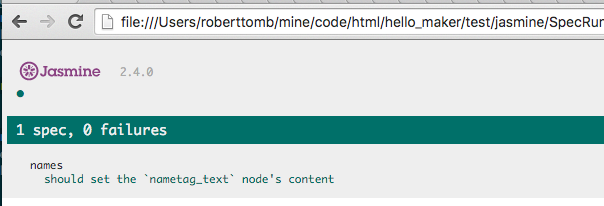

1. Now, just to make sure our test is doing something, let's make it fail. One
   way would be to change what the test is looking for, but, instead, I'm going 
   to recommend you break the JavaScript. 

   Open names.js in a text editor and change the DOM id that the nameIt function
   is looking for:

   Passing

   ```
   function nameIt(nameVal) {
     var theNode = document.getElementById("nametag_text");
     theNode.textContent = nameVal;
   
     return true;
   }
   ```

   Failing
   ```
   function nameIt(nameVal) {
     var theNode = document.getElementById("xnametag_text");
     theNode.textContent = nameVal;
   
     return true;
   }
   ```

   Subtle change, I'm sure, but I changed nametag_text to **xnametag_text** so
   now the test fails

   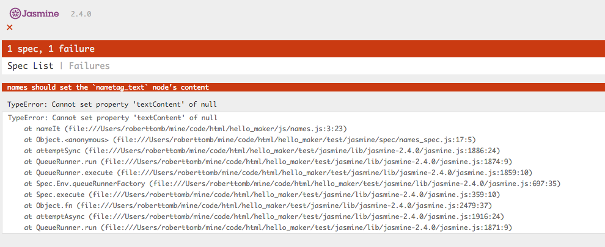

### Picking apart the test code

This syntax is Jasmine, which is a JavaScript DSL (Domain Specific Language) 
for writing unit tests. (I know, they claim to be BDD, but most people really 
write unit tests despite claiming to be testing behavior with this tool. Any 
time you test in isolation, you are testing a unit, even if you can describe the 
intended behavior with rich, human-readable language, like we do in Jasmine. If 
you want to do true BDD on browser-based projects, look into driving 
[Selenium](http://www.seleniumhq.org/) with Jasmine, or use 
[Mocha](https://mochajs.org/) with the excellent 
[chai JavaScript assertions](http://chaijs.com/) to drive your browser through 
Selenium. The deal is, if you're not testing it the way your user experiences it, 
you're not testing behavior.) I'm not just picking on BDD here, it's really just
funny how people will latch on to a name for something even if they aren't doing
it. Some people use well-known unit testing frameworks to drive behavioral or 
integration tests and they call them unit tests, despite needing a huge 
dependency chain configured and running just to support the tests. 

The point is, you are testing what you are testing, and testing is a good thing, 
so don't get caught up in the name of your tooling. You chose the tooling, 
hopefully, because it makes you productive and not because of an industry 
buzzword. 

Anyway, enough controversial topics for the day. Let's deconstruct the Jasmine 
code so you can benefit from what we've done here.

While this is the Jasmine DSL, the general concepts will apply to most 
unit testing frameworks.

On the first line we call a jasmine function named `describe` and we pass a 
string and a function to it. The string shows up in our test output

```
describe("names", function() {
```

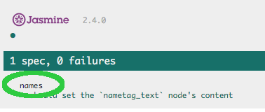

The function encapsulates all of the rest of the code for the test. 

Before we get to the actual test, let's get the housekeeping steps covered. 
Notice there are two methods being called: `beforeEach` and `afterEach`. Most 
unit testing frameworks have methods the will run to set up and tear down for 
each of the tests in their scope. That's what these do.

In my implementation, I am creating the DOM elements that my nameIt function 
interacts with when it is added to an html page in the `beforeEach` method. 
This way, when it tests my method, all the right pieces will be in place:

```
  beforeEach(function() {
    testNode = document.createElement("div");
    testNode.setAttribute("id","nametag_text");
    document.body.appendChild(testNode);
  });

```

If you are running multiple tests, you also want to clean up after yourself 
before running a new test or else you cannot really trust the results. Some 
engineers will try to write progressive tests that build upon the results of 
previous tests. These can be very brittle and hard to maintain. Some purists 
will tell you that you're doing it wrong if you do it that way. I will say that
I try to avoid doing that, but people have their reasons, sometimes it's for
performance (setup and teardown can take a lot of time), and sometimes it's 
because they're black-box testing and cannot change the code, but, in reality 
sometimes it's for misguided reasons. Heck... there are worse sins than 
testing, such as, NOT TESTING!

Oh yeah, I digress... I'm using `afterEach` to wipe out the div I create in 
`beforeEach`, so the DOM will be clean for the next test I write:

```
  afterEach(function() {
    var toDel = document.getElementById("nametag_text");
    toDel.parentElement.removeChild(toDel);
  });
```

Now on to the actual test.

```
  it("should set the `nametag_text` node's content", function() {
    var testVal = "foo";
    nameIt(testVal);
    expect(document.getElementById("nametag_text").textContent).toEqual(testVal);
  });
```

We call the `it` method. Yeah... `it`. Seems weird, but stick with me. Remember,
we are in a `describe` method for something we called "names" and we are going 
to call `it` and supply that with a descriptive phrase. Try to read this as a
sentence. Describe "names" it "should set the nametag_text node's content".
See? Then in that test (encapsulated in a JavaScript function) we set the 
variable `testVal`, pass it to our nameIt function as an argument, and we 
describe our expectation:

```
    expect(document.getElementById("nametag_text").textContent).toEqual(testVal);
```

We, expect the "nametag_text" node's text to equal the value we passed into our 
nameIt function. That string we pass into the `it` method as our first argument 
is displayed in the test results page in your browser:

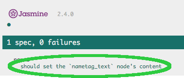

So, you should be able to find your results, easily. As well, if you do a nice 
job of writing accurate and descriptive messages, you can share these results 
with non-technical (or slightly-less-technical) people who are involved with 
your project. They can look at your tests and understand the behavior you have 
described. Some people would say the behavior of your code, but, in reality, if
you write poor or inaccurate descriptions, they won't know what it's really 
doing. 

## Step 9 - Getting more complex

Let's look at how we could write multiple nametags. We'll use the same form and
if you enter multiple names separated by commas, we'll create a nametag for each
one. 

Notice, we'll use the same names.js file and the same hello.css. This time, 
though, we will start with a blank-ish looking page. The other behavioral thing 
to note is that our form will append nametags to the `more_tags` div each time 
it's run until the page is refreshed. We'll write tests that express that 
intent, as well.

1. Add the following to a page called `hellos.html` and we'll get started:

   ```
   <html>
     <head>
       <title>hello all</title>
       <link rel="stylesheet" type="text/css" href="css/hello.css"/>
       <script src="js/names.js"> </script>
     </head>
     <body> 
       <form>
         <label for="helloname">What Names?</label>
         <input type="text" name="helloname" id="name" />
         <input type="button" onclick="nameThem(this.form.helloname.value)" value="say hellos"/>
       </form>
       <div id="more_tags"></div>
     </body>
   </html>
   ```

1. Now, open names.js and add the following shell of a function definition:

   ```
   function nameThem(nameVals) {
   }
   ```

   **Huh?** Stick with me, we're going to do tests and code along with each 
   other this time. The reality is, the longer you take to write tests after 
   you have written code, the crappier your tests will be. The crappiest test 
   is the one that's never written. 

   In this case, we can do Test Driven Development because we're expanding on 
   something we already know. When you're learning something, you have to poke 
   at it a bit before you even understand how to code it, let alone, how to 
   accurately assert if it's working.

1. Open names_spec.js. Before we dive into the test code, what do we know? 
   Well, we know we want to:

   * create a nametag for each name added in the text box
   * names will be separated with commas ","
   * we want to append to our `more_tags` div each time we're called

   Let's add a new `describe` since we're describing a slightly different 
   context:

   ```
    describe("multinames", function() {
    });
   ```
   We can write those tests, but, first, let's get the DOM set right in our 
   `beforeEach` and `afterEach` methods. For nameThem to work on our page, 
   we are going to need a `more_tags` div.

   ```
    beforeEach(function() {
      var testNode = document.createElement("div");
      testNode.setAttribute("id","more_tags");
      document.body.appendChild(testNode);
    });
   ```
   
   There. We'll just create a `more_tags` node for this context. These methods
   will be run before and after each test WITHIN this describe context. 

1. Let's clean up after ourselves too. 

   ```
    afterEach(function() {
      var toDel = document.getElementById("more_tags");
      toDel.parentElement.removeChild(toDel);
    });
   ```

1. Let's add our first test. The easiest thing we know is that we want to 
   be able to handle multiple names and we will separate those names with 
   commas. We plan to write those new children to our `more_tags` div, so 
   the easiest test will be to see how many children that div has:

   ```
    it("should create 2 children under more_tags when 2 names are passed in", function() {
      var testVal = "foo,bar";
      nameThem(testVal);
      expect(document.getElementById("more_tags").childNodes.length).toEqual(2);
    });
   ```

   Calling `childNodes` on the `more_tags` node will give us a list of all 
   children and we can test its length. Since we haven't written our 
   implementation, yet, our test fails:

   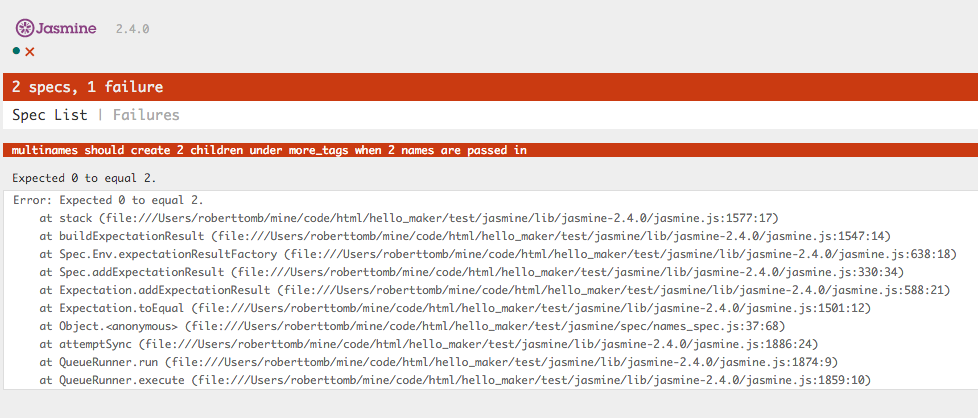

1. Let's create enough implementation to pass:
   ```
   function nameThem(nameVals) {
     var names = nameVals.split(',');
     var theNode = document.getElementById("more_tags");
     for ( var count = 0; count < names.length; count++ ) {
       var helloDiv = document.createElement("div");
       theNode.appendChild(helloDiv);
     }
     return true;
   }
   ```

   Not fully functional, yet, but it will create child nodes. To point out what
   we're doing here, look at the first line of the function, I am calling a 
   function called `split` on the nameVals argument. What that does, when fed
   with an argument, is to break a string on whatever the character is in the
   argument. In this case, it will split any string on commas. The returning
   value from that is an array of values. 

   You should do some research on [JavaScript arrays](https://developer.mozilla.org/en-US/docs/Web/JavaScript/Reference/Global_Objects/Array). I will use a for loop to 
   walk through each element of the array until we reach the end of the array.

   While you're at it, you should look at [JavaScript for loops](https://developer.mozilla.org/en-US/docs/Web/JavaScript/Reference/Statements/for)

1. Let's test that it will not create multiple nodes when we pass in one name 
   and will not mistake names with spaces as two names.

   ```
    it("should create 1 child under more_tags when 1 name is passed in", function() {
      var testVal = "foo";
      nameThem(testVal);
      expect(document.getElementById("more_tags").childNodes.length).toEqual(1);
    });
   ```

   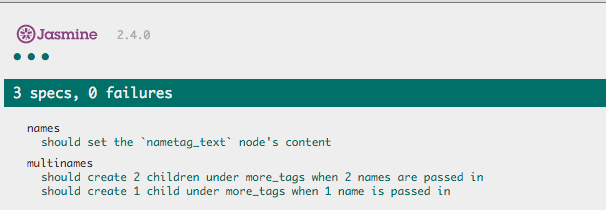

1. Let's test that it will not create multiple nodes when we pass in one name 
   that has a space in it.

   ```
    it("should create 1 child under more_tags when 1 name with spaces is passed in", function() {
      var testVal = "Billy Jo";
      nameThem(testVal);
      expect(document.getElementById("more_tags").childNodes.length).toEqual(1);
    });
   ```

   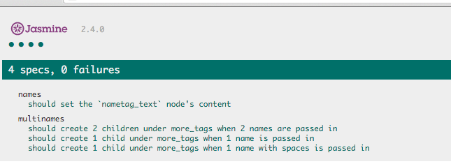

1. Hmm... what happens if we pass in an empty string? This will happen if someone
   hits the "say hello" button before they enter anything. Let's make sure we don't
   create empty nametags

   ```
    it("should create 0 children under more_tags when an empty string is passed in", function() {
      var testVal = "";
      nameThem(testVal);
      expect(document.getElementById("more_tags").childNodes.length).toEqual(0);
    });
   ```

   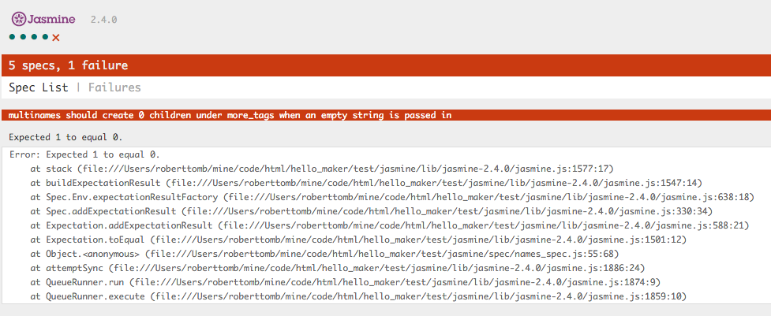

1. Failed! Let's fix that by testing for empty string before doing anything:
   
   ```
    function nameThem(nameVals) {
      if ( nameVals != "" ) {
        var names = nameVals.split(',');
        var theNode = document.getElementById("more_tags");
        for ( var count = 0; count < names.length; count++ ) {
          var helloDiv = document.createElement("div");
          theNode.appendChild(helloDiv);
        }
      }
      return true;
    }
   ```

   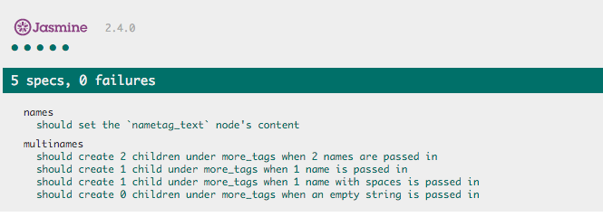

1. Now that we're handling many of the name-to-div cases, we should make sure 
   we create divs that look like we want them to look. Since we know what this 
   code would look like in the DOM, we can test for it. 

   ```
    it("should create children under more_tags with the right style", function() {
      var testName = "foo";
      var expectedClass = "tag";
      nameThem(testName);
      expect(document.getElementById("more_tags").firstChild.getAttribute("class")).toEqual(expectedClass);
    });
   ```

   Since we create these child nodes in a loop and they should be basically 
   templates of each other, it should be fairly safe to just test the first one.
   If you wanted to be overly cautious, you could copy all of the above tests
   and make sure that nodes are created with the right CSS class in every case.

   Now... something can happen to prove me wrong, but this should do for now:

   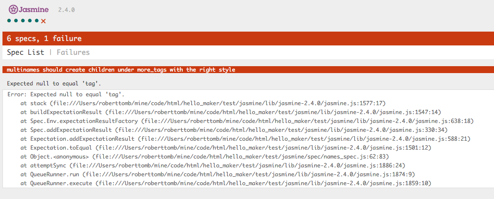

1. Let's add style to our nodes and see if the test will pass:
   ```
    function nameThem(nameVals) {
      if ( nameVals != "" ) {
        var names = nameVals.split(',');
        var theNode = document.getElementById("more_tags");
        for ( var count = 0; count < names.length; count++ ) {
          var helloDiv = document.createElement("div");
          helloDiv.setAttribute("class", "tag");
          theNode.appendChild(helloDiv);
        }
      }
      return true;
    }
   ```
   
   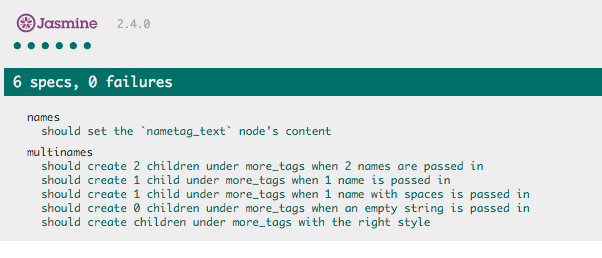

1. Awesome! Let's try out `hellos.html` in the browser and see how friggin 
   fabulous this is:

   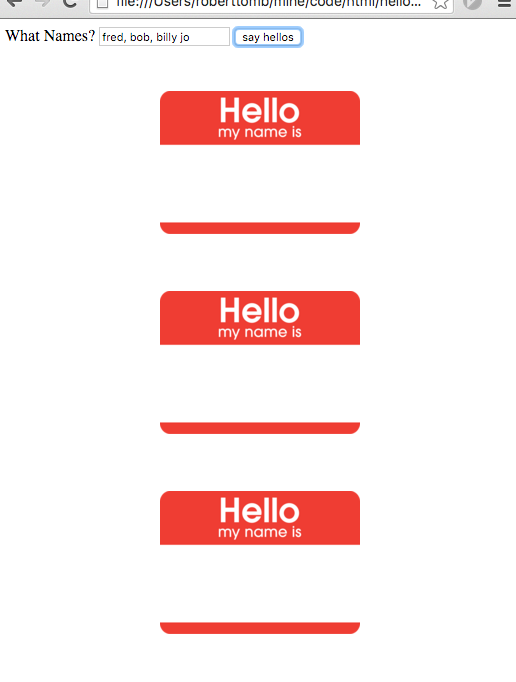

   **WAT???** Oops, we forgot to add our names! 

1. Let's add a test that makes sure we add a name in a tag with the name as its
   content. This can be like our style test as we will either get them all 
   wrong or all right:
   ```
    it("should create children under more_tags's children with the name in there", function() {
      var testName = "foo";
      nameThem(testName);
      expect(document.getElementById("more_tags").firstChild.firstChild.textContent).toEqual(testName);
    });
   ```

   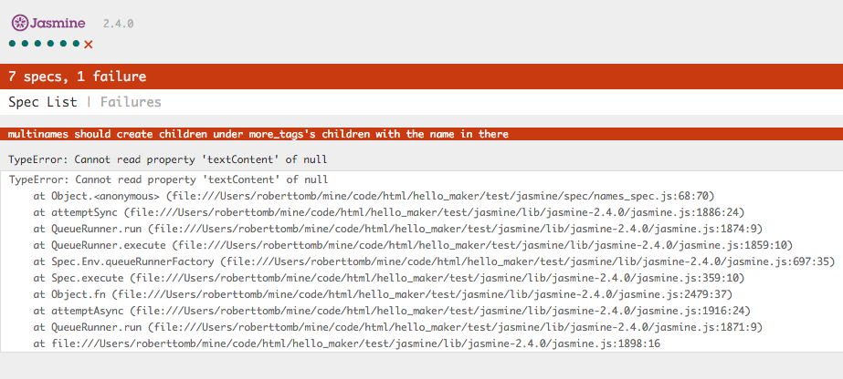

1. We could write a better test than that, but it'll do for now, I don't want 
   to crush you under any more details. Let's make that test pass:

   ```
   function nameThem(nameVals) {
     if ( nameVals != "" ) {
       var names = nameVals.split(',');
       var theNode = document.getElementById("more_tags");
       for ( var count = 0; count < names.length; count++ ) {
         var nameVal = names[count].trim();
         var h1 = document.createElement("h1");
         var namedH1 = document.createTextNode(nameVal);
         h1.appendChild(namedH1);
   
         var helloDiv = document.createElement("div");
         helloDiv.setAttribute("class", "tag");
         helloDiv.appendChild(h1);
   
         theNode.appendChild(helloDiv);
       }
     }
     return true;
   }
   ```

   Back to our array. Look at the first line within the for loop. I have used
   the `count` variable created in the `for` loop to reference a specific 
   element in the `names` array. We will execute this loop for each element
   in the names array and pick that value out of the array using the `count` 
   variable, which is being incremented by the for loop.

   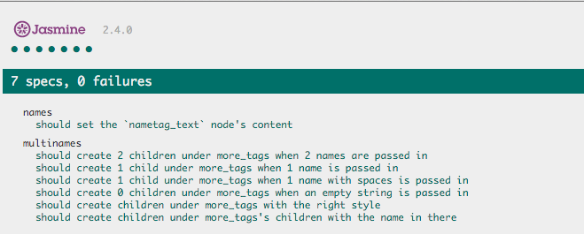

1. Back to our html page, let's try hellos.html in the browser:
   
   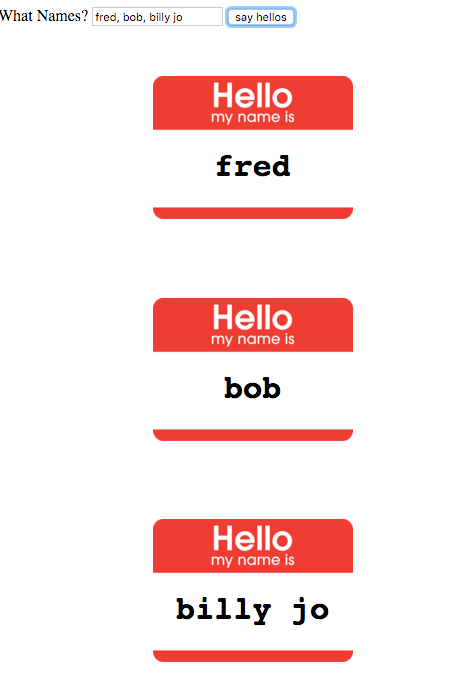


